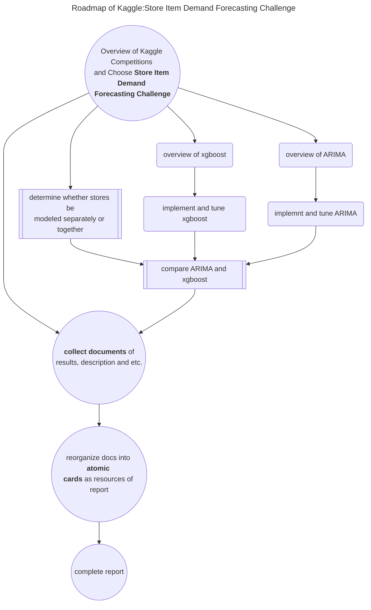

# MSAI6102 Project
    
    NTU MSAI6102 2024Spring Project

## Project Structure

- **`docs\`:**
*documents consist of `project_overview`, `roadmap` and `POW` etc. Most Importantly, project notes prepared for report should also be included in this folder*.
*Majority of `docs\` are organized on* [**Notion Link**](https://www.notion.so/Teamspace-Home-5461cf9710624129b99e4f255369e91e)

- **`reference\`:**
*some references for project*

- **`report\`:**
*future report and related resources should be included in this folder*

- **`src\`:**
*project source codes and test/training data*
  - `data\`

